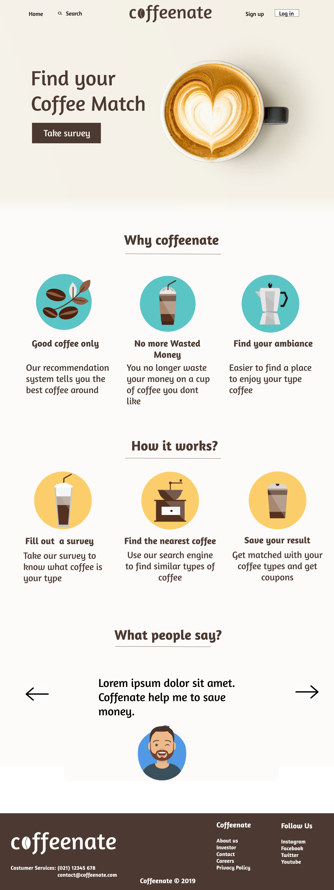
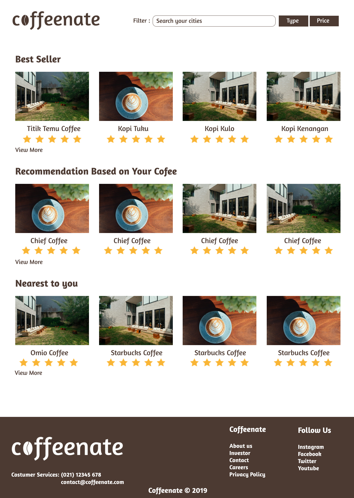
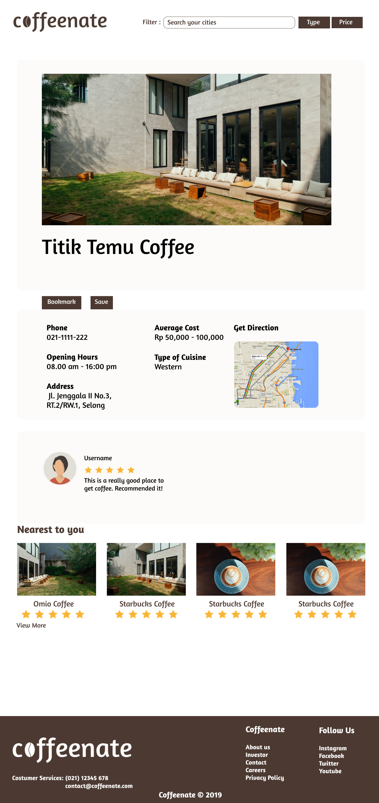

# Coffeenate Discussion + Design

This repo is to manage all discussion and design asset of Coffenate. 

- Frontend Data Documentation 
- Backend API Documentation 

## 1. Table of Contents 

- i.    Table of Contents
- ii.   Introduction 
- iii.  Links 
- iv.   Development Setup
- v.    Features
- vi.   Management Accounts
- vii.  Technology & Design Stack 
- viii. Design _8.1. Logo Design _8.2. Desktop Design
- ix.   License

## 2.  Introduction 

Schedule for this full stack project: 
- Saturday & Sunday: Design UI & UX in Figma
- Monday & Tuesday: Implement frontend components in React
- Wednesday & Thursday: Give interactivity with Redux
- Friday: Integrate frontend and backend
- Saturday: Present full stack project with slide

## 3.   Links 
- Organization: 
  - https://github.com/coffeenate-haku
- Repositories: 
  - https://github.com/coffeenate-haku/frontend
  - https://github.com/coffeenate-haku/backend

## 4.  Development Setup
- Determine a team/app name
  - Coffeenate
- Create a Gmail account
  - coffeenate.haku@gmail.com
- Create a Github account
  - 
- Update organization profile in settings
  - https://github.com/coffeenate-haku/settings/profile
- Add team members on Github
  - https://github.com/orgs/coffeenate-haku/people
- Setup repositores 
  - ```primary```: https://github.com/orgs/coffeenate-haku/
  - ```frontend```: https://github.com/coffeenate-haku/frontend
  - ```backend``` : https://github.com/coffeenate-haku/backend
- Protect ```master``` branches
  - 
- Setup project with linked repositories 
  - 

## 5. Features 
- 

## 6. Management Accounts

## 7. Technology & Design Stack

## 8. Design 
### 8.1. Logo Design 
Figma: https://www.figma.com/file/GrXqEANqKsSvFu3N5yGnNd/Coffeenate?node-id=0%3A1


### 8.2. Desktop Design 
Figma: https://www.figma.com/file/GrXqEANqKsSvFu3N5yGnNd/Coffeenate?node-id=0%3A1




## 9. License 
- MIT License
- Creative Commons Attribution-NonCommercial-ShareAlike 4.0 International License


